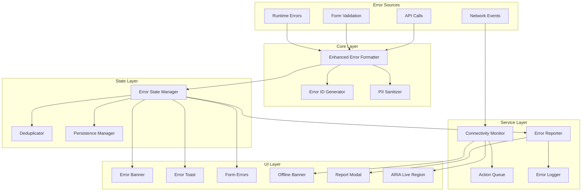

# Design Document: Error Messaging Improvements

## Overview

This design enhances the existing error handling system to provide a comprehensive, user-friendly error experience. The system builds on the current `errorFormatter.ts` foundation, adding contextual messaging, actionable recovery options, offline handling, accessibility improvements, and user error reporting.

The architecture follows a layered approach:

1. **Core Layer**: Enhanced error formatting with context and unique IDs
2. **State Layer**: Error state management with deduplication and persistence
3. **UI Layer**: Accessible error components (banners, toasts, forms)
4. **Service Layer**: Connectivity monitoring, action queuing, error reporting

## Architecture



## Components and Interfaces

### Enhanced Error Formatter

Extends the existing `errorFormatter.ts` with context support and unique ID generation.

```typescript
interface ErrorContext {
  /** What action the user was performing */
  action: string
  /** Component where error occurred */
  component?: string
  /** Additional metadata */
  metadata?: Record<string, unknown>
}

interface EnhancedFormattedError extends FormattedError {
  /** Unique error ID for tracking */
  id: string
  /** Timestamp when error occurred */
  timestamp: number
  /** Action context if provided */
  context?: ErrorContext
  /** Whether error requires user acknowledgment */
  requiresAcknowledgment: boolean
  /** Whether error should persist across navigation */
  persistent: boolean
  /** Recovery actions available */
  recoveryActions: RecoveryAction[]
}

interface RecoveryAction {
  /** Button label */
  label: string
  /** Action type for handling */
  type: 'retry' | 'navigate' | 'focus' | 'custom' | 'countdown'
  /** Handler function or navigation path */
  handler?: () => Promise<void> | void
  /** Navigation path for 'navigate' type */
  path?: string
  /** Element selector for 'focus' type */
  selector?: string
  /** Countdown duration in seconds for 'countdown' type */
  countdownSeconds?: number
}

function formatErrorWithContext(error: unknown, context?: ErrorContext): EnhancedFormattedError

function generateErrorId(): string

function sanitizePII(data: unknown): unknown
```

### Error State Manager

Manages error state with deduplication, persistence, and ordering.

```typescript
interface ErrorState {
  /** Active errors keyed by ID */
  errors: Map<string, EnhancedFormattedError>
  /** Count of duplicate occurrences per error signature */
  duplicateCounts: Map<string, number>
  /** Errors that persist across navigation */
  persistentErrors: Set<string>
}

interface ErrorStateManager {
  /** Add a new error */
  addError(error: EnhancedFormattedError): void
  /** Remove an error by ID */
  removeError(id: string): void
  /** Clear all transient errors (on navigation) */
  clearTransient(): void
  /** Get all active errors sorted by timestamp (newest first) */
  getErrors(): EnhancedFormattedError[]
  /** Check if an error with same signature exists */
  isDuplicate(error: EnhancedFormattedError): boolean
  /** Increment duplicate count */
  incrementDuplicate(signature: string): number
  /** Subscribe to error state changes */
  subscribe(callback: (errors: EnhancedFormattedError[]) => void): () => void
}
```

### Connectivity Monitor

Tracks online/offline status and manages action queuing.

```typescript
interface QueuedAction {
  /** Unique action ID */
  id: string
  /** Action to execute */
  execute: () => Promise<unknown>
  /** Description for user feedback */
  description: string
  /** Timestamp when queued */
  queuedAt: number
  /** Number of retry attempts */
  retryCount: number
}

interface ConnectivityMonitor {
  /** Current online status */
  isOnline: boolean
  /** Queue an action for when online */
  queueAction(action: Omit<QueuedAction, 'id' | 'queuedAt' | 'retryCount'>): string
  /** Get all queued actions */
  getQueuedActions(): QueuedAction[]
  /** Clear the queue */
  clearQueue(): void
  /** Subscribe to connectivity changes */
  onConnectivityChange(callback: (isOnline: boolean) => void): () => void
  /** Announce connectivity change to screen readers */
  announceConnectivity(isOnline: boolean): void
}
```

### Error Reporter

Handles user error reporting with local fallback.

```typescript
interface ErrorReport {
  /** Error ID being reported */
  errorId: string
  /** Sanitized error message */
  message: string
  /** Sanitized stack trace */
  stackTrace?: string
  /** User's additional context */
  userDescription?: string
  /** Screenshot data URL */
  screenshot?: string
  /** Browser and device info */
  deviceInfo: DeviceInfo
  /** User actions leading to error */
  actionHistory: string[]
  /** Timestamp */
  timestamp: number
}

interface DeviceInfo {
  userAgent: string
  platform: string
  language: string
  screenSize: string
  viewportSize: string
}

interface ErrorReporter {
  /** Submit an error report */
  submitReport(report: ErrorReport): Promise<{ referenceNumber: string }>
  /** Save report locally if submission fails */
  saveLocally(report: ErrorReport): void
  /** Get locally saved reports */
  getLocalReports(): ErrorReport[]
  /** Retry submitting local reports */
  retryLocalReports(): Promise<void>
}
```

### UI Components

#### ErrorBanner Component

```typescript
interface ErrorBannerProps {
  /** Error to display */
  error: EnhancedFormattedError
  /** Duplicate count if applicable */
  duplicateCount?: number
  /** Called when error is dismissed */
  onDismiss?: () => void
  /** Called when recovery action completes */
  onRecoveryComplete?: () => void
  /** Whether to auto-focus the banner */
  autoFocus?: boolean
  /** Element to return focus to on dismiss */
  returnFocusTo?: HTMLElement | null
}
```

#### FormFieldError Component

```typescript
interface FormFieldErrorProps {
  /** Field name for ARIA association */
  fieldName: string
  /** Error message */
  message: string
  /** Suggestion for fixing */
  suggestion?: string
  /** Field input element ref for focus */
  inputRef?: React.RefObject<HTMLInputElement>
}
```

#### ErrorToast Configuration

```typescript
interface ErrorToastConfig {
  /** Error to display */
  error: EnhancedFormattedError
  /** Duration in ms (0 for persistent) */
  duration: number
  /** Whether to show recovery actions */
  showActions: boolean
}

function getToastDuration(error: EnhancedFormattedError): number {
  // Errors requiring acknowledgment don't auto-dismiss
  if (error.requiresAcknowledgment) return 0
  // Rate limit errors show countdown
  if (error.category === 'rateLimit') return 0
  // Default duration
  return 5000
}
```

#### OfflineBanner Component

```typescript
interface OfflineBannerProps {
  /** Number of queued actions */
  queuedCount: number
  /** Features available offline */
  offlineFeatures: string[]
  /** Features requiring connectivity */
  onlineFeatures: string[]
}
```

#### ErrorReportModal Component

```typescript
interface ErrorReportModalProps {
  /** Error being reported */
  error: EnhancedFormattedError
  /** Whether modal is open */
  isOpen: boolean
  /** Called when modal closes */
  onClose: () => void
  /** Called when report is submitted */
  onSubmit: (report: ErrorReport) => Promise<void>
}
```

## Data Models

### Error Signature

Used for deduplication - errors with the same signature are considered duplicates.

```typescript
function getErrorSignature(error: EnhancedFormattedError): string {
  return `${error.category}:${error.message}:${error.context?.action || 'unknown'}`
}
```

### Retry Configuration

```typescript
interface RetryConfig {
  /** Maximum retry attempts */
  maxAttempts: number
  /** Base delay in ms */
  baseDelay: number
  /** Maximum delay in ms */
  maxDelay: number
  /** Backoff multiplier */
  backoffMultiplier: number
}

const DEFAULT_RETRY_CONFIG: RetryConfig = {
  maxAttempts: 3,
  baseDelay: 1000,
  maxDelay: 30000,
  backoffMultiplier: 2,
}

function calculateBackoffDelay(attempt: number, config: RetryConfig): number {
  const delay = config.baseDelay * Math.pow(config.backoffMultiplier, attempt)
  return Math.min(delay, config.maxDelay)
}
```

### Local Storage Schema

```typescript
interface LocalErrorStorage {
  /** Pending error reports */
  pendingReports: ErrorReport[]
  /** Queued actions (serializable only) */
  queuedActionDescriptions: string[]
  /** Persistent error IDs */
  persistentErrorIds: string[]
}
```

## Correctness Properties

_A property is a characteristic or behavior that should hold true across all valid executions of a system—essentially, a formal statement about what the system should do. Properties serve as the bridge between human-readable specifications and machine-verifiable correctness guarantees._

### Property 1: Contextual Error Formatting

_For any_ error and action context, when `formatErrorWithContext` is called with both parameters, the resulting error message SHALL contain the action context description.

**Validates: Requirements 1.1, 1.2**

### Property 2: Multiple Error Combination

_For any_ array of errors with the same action context, when combined, the result SHALL be a single error message that references all original errors and maintains the shared context.

**Validates: Requirements 1.4**

### Property 3: Recovery Action Presence by Category

_For any_ error category, the formatted error SHALL include at least one recovery action appropriate for that category.

**Validates: Requirements 2.1**

### Property 4: Exponential Backoff Calculation

_For any_ retry attempt number n, the calculated delay SHALL equal `baseDelay * (backoffMultiplier ^ n)` capped at `maxDelay`.

**Validates: Requirements 2.2**

### Property 5: Rate Limit Countdown

_For any_ rate limit error with a retry-after duration, the countdown timer SHALL decrement by 1 second each second until reaching 0.

**Validates: Requirements 2.6**

### Property 6: Offline Action Queuing

_For any_ action attempted while offline, the action SHALL be added to the queue and the queue length SHALL increase by 1.

**Validates: Requirements 3.2**

### Property 7: Queue Processing on Reconnect

_For any_ non-empty action queue when connectivity is restored, all queued actions SHALL be executed and the queue SHALL be empty after processing completes.

**Validates: Requirements 3.3**

### Property 8: Network Error Messaging

_For any_ error caused by network issues while offline, the error message SHALL indicate the action will be retried when connectivity is restored.

**Validates: Requirements 3.4**

### Property 9: Field Error ARIA Association

_For any_ form field with a validation error, the field input SHALL have `aria-invalid="true"` and `aria-describedby` pointing to the error message element.

**Validates: Requirements 4.4**

### Property 10: Error Summary Completeness

_For any_ form with N validation errors, the error summary SHALL list exactly N error messages.

**Validates: Requirements 4.5**

### Property 11: Error Clearing on Correction

_For any_ field with a validation error, when the field value becomes valid, the error message SHALL be removed immediately.

**Validates: Requirements 4.3**

### Property 12: Error Report Content Completeness

_For any_ submitted error report, the report SHALL contain: error message, sanitized stack trace, device info, and timestamp.

**Validates: Requirements 5.3**

### Property 13: Local Storage Fallback

_For any_ error report that fails to submit, the report SHALL be saved to local storage and retrievable via `getLocalReports()`.

**Validates: Requirements 5.5**

### Property 14: ARIA Live Region Announcements

_For any_ error that occurs, the ARIA live region SHALL be updated with the error message and have `aria-live="assertive"` for critical errors or `aria-live="polite"` for non-critical errors.

**Validates: Requirements 6.1**

### Property 15: Toast Persistence by Error Type

_For any_ error that requires user acknowledgment, the toast duration SHALL be 0 (no auto-dismiss).

**Validates: Requirements 6.6**

### Property 16: Unique Error ID Generation

_For any_ two errors generated, their IDs SHALL be different.

**Validates: Requirements 7.1**

### Property 17: Error Deduplication

_For any_ error with the same signature as an existing error, the duplicate count SHALL increase by 1 and no new error entry SHALL be created.

**Validates: Requirements 7.2**

### Property 18: Error Ordering

_For any_ set of errors, `getErrors()` SHALL return them sorted by timestamp in descending order (newest first).

**Validates: Requirements 7.6**

### Property 19: Transient Error Clearing

_For any_ navigation event, all non-persistent errors SHALL be removed and all persistent errors SHALL remain.

**Validates: Requirements 7.4**

### Property 20: PII Redaction

_For any_ logged error data, email addresses, phone numbers, and names SHALL be replaced with redaction placeholders.

**Validates: Requirements 8.5**

## Error Handling

### Recovery Action Failures

When a recovery action fails:

1. Show a secondary error toast indicating the recovery failed
2. Keep the original error visible
3. Log the recovery failure for debugging
4. Offer alternative recovery options if available

### Queue Processing Failures

When a queued action fails after reconnection:

1. Retry with exponential backoff up to max attempts
2. If all retries fail, show error toast with manual retry option
3. Remove from queue after max attempts exceeded
4. Log failure for debugging

### Error Report Submission Failures

When error report submission fails:

1. Save report to local storage
2. Show toast indicating report saved locally
3. Retry submission on next app load or connectivity restoration
4. Provide manual "Retry Reports" option in settings

## Testing Strategy

### Unit Tests

Unit tests will cover:

- Error formatting with various inputs and contexts
- Error signature generation and deduplication logic
- Backoff delay calculations
- PII sanitization patterns
- ARIA attribute generation
- Toast duration determination

### Property-Based Tests

Property-based tests will validate the correctness properties defined above using fast-check:

- Generate random errors and verify formatting invariants
- Generate random retry attempts and verify backoff calculations
- Generate random error sequences and verify deduplication
- Generate random PII patterns and verify redaction

**Test Configuration:**

- Minimum 100 iterations per property test
- Use fast-check for TypeScript property-based testing
- Tag format: **Feature: error-messaging-improvements, Property {number}: {property_text}**

### Integration Tests

Integration tests will cover:

- Error flow from API call to toast display
- Offline queuing and reconnection processing
- Form validation with field-level errors
- Error report submission and local fallback
- Focus management across error states

### Accessibility Tests

Accessibility tests will verify:

- ARIA live region announcements
- Keyboard navigation through error UI
- Focus management on error display and dismiss
- Screen reader compatibility
