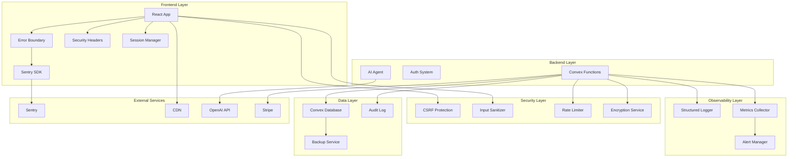

# Production Readiness Design Document

## Overview

This design document outlines the technical approach for making Open Event production-ready. The platform currently has a solid foundation with React 19, TypeScript, Convex backend, and AI-powered features. However, it requires critical security hardening, monitoring infrastructure, compliance features, and operational improvements before serving real users in production.

The design follows a layered approach:

- **Security Layer**: CSRF protection, input sanitization, rate limiting, encryption
- **Observability Layer**: Sentry integration, structured logging, metrics, alerting
- **Compliance Layer**: GDPR features (data export, deletion), audit trails, cookie consent
- **Resilience Layer**: Backup systems, disaster recovery, AI fallbacks, circuit breakers
- **Performance Layer**: CDN, caching, bundle optimization, lazy loading
- **Operations Layer**: Documentation, runbooks, deployment procedures

This design prioritizes security and data protection while maintaining the platform's user experience and AI capabilities.

## Architecture

### High-Level Architecture



### Security Architecture

The security layer implements defense-in-depth with multiple protection mechanisms:

1. **Frontend Security**:
   - Content Security Policy (CSP) headers prevent XSS attacks
   - Secure HTTP headers (HSTS, X-Frame-Options, X-Content-Type-Options)
   - Session timeout enforcement (15 minutes idle)
   - Input sanitization before rendering user content

2. **Backend Security**:
   - CSRF token validation for all mutations
   - Request size limits (prevent DoS)
   - Rate limiting per user/IP
   - API key encryption at rest
   - Input validation and sanitization

3. **Authentication Security**:
   - Secure session management
   - Failed login attempt tracking
   - Account lockout after repeated failures
   - Audit logging for all auth events

### Observability Architecture

Comprehensive monitoring across all layers:

1. **Error Tracking**: Sentry captures frontend and backend errors with context
2. **Structured Logging**: Consistent log format with levels (debug, info, warn, error)
3. **Metrics Collection**: Performance metrics, API usage, database query times
4. **Alerting**: Critical errors trigger notifications (email, Slack, PagerDuty)
5. **Dashboards**: Real-time visualization of system health

### Data Protection Architecture

GDPR-compliant data handling:

1. **Data Export**: Users can download all their data in JSON format
2. **Data Deletion**: Complete data purge including backups
3. **Audit Trail**: All data access and modifications logged
4. **Encryption**: Sensitive data encrypted at rest
5. **Retention Policies**: Automated cleanup of old data

## Components and Interfaces

### 1. Security Components

#### CSRF Protection Middleware

```typescript
// convex/lib/security/csrf.ts
interface CSRFConfig {
  tokenLength: number
  cookieName: string
  headerName: string
}

interface CSRFToken {
  token: string
  expiresAt: number
}

class CSRFProtection {
  generateToken(userId: string): CSRFToken
  validateToken(token: string, userId: string): boolean
  rotateToken(userId: string): CSRFToken
}
```

#### Input Sanitizer

```typescript
// convex/lib/security/sanitizer.ts
interface SanitizerConfig {
  allowedTags: string[]
  allowedAttributes: Record<string, string[]>
  maxLength: number
}

class InputSanitizer {
  sanitizeHTML(input: string): string
  sanitizeText(input: string): string
  validateInput(input: unknown, schema: Schema): ValidationResult
}
```

#### Rate Limiter

```typescript
// convex/lib/security/rateLimiter.ts
interface RateLimitConfig {
  windowMs: number
  maxRequests: number
  keyGenerator: (ctx: Context) => string
}

interface RateLimitResult {
  allowed: boolean
  remaining: number
  resetAt: number
}

class RateLimiter {
  checkLimit(key: string, config: RateLimitConfig): Promise<RateLimitResult>
  resetLimit(key: string): Promise<void>
}
```

#### Encryption Service

```typescript
// convex/lib/security/encryption.ts
interface EncryptionConfig {
  algorithm: string
  keyDerivation: string
}

class EncryptionService {
  encrypt(plaintext: string, key: string): string
  decrypt(ciphertext: string, key: string): string
  hash(data: string): string
  compareHash(data: string, hash: string): boolean
}
```

### 2. Monitoring Components

#### Sentry Integration

```typescript
// src/lib/monitoring/sentry.ts
interface SentryConfig {
  dsn: string
  environment: string
  tracesSampleRate: number
  replaysSessionSampleRate: number
}

class SentryMonitoring {
  initialize(config: SentryConfig): void
  captureError(error: Error, context?: Record<string, unknown>): void
  captureMessage(message: string, level: 'info' | 'warning' | 'error'): void
  setUser(user: { id: string; email: string }): void
  addBreadcrumb(breadcrumb: Breadcrumb): void
}
```

#### Structured Logger

```typescript
// convex/lib/monitoring/logger.ts
type LogLevel = 'debug' | 'info' | 'warn' | 'error'

interface LogEntry {
  level: LogLevel
  message: string
  timestamp: number
  context: Record<string, unknown>
  userId?: string
  requestId?: string
}

class StructuredLogger {
  debug(message: string, context?: Record<string, unknown>): void
  info(message: string, context?: Record<string, unknown>): void
  warn(message: string, context?: Record<string, unknown>): void
  error(message: string, error: Error, context?: Record<string, unknown>): void
}
```

#### Metrics Collector

```typescript
// convex/lib/monitoring/metrics.ts
interface Metric {
  name: string
  value: number
  timestamp: number
  tags: Record<string, string>
}

class MetricsCollector {
  recordCounter(name: string, value: number, tags?: Record<string, string>): void
  recordGauge(name: string, value: number, tags?: Record<string, string>): void
  recordHistogram(name: string, value: number, tags?: Record<string, string>): void
  recordTiming(name: string, durationMs: number, tags?: Record<string, string>): void
}
```

#### Alert Manager

```typescript
// convex/lib/monitoring/alerts.ts
type AlertChannel = 'email' | 'slack' | 'pagerduty'
type AlertSeverity = 'info' | 'warning' | 'critical'

interface Alert {
  title: string
  message: string
  severity: AlertSeverity
  channels: AlertChannel[]
  metadata: Record<string, unknown>
}

class AlertManager {
  sendAlert(alert: Alert): Promise<void>
  configureThresholds(metric: string, threshold: number, severity: AlertSeverity): void
  checkThresholds(): Promise<void>
}
```

### 3. Compliance Components

#### Data Export Service

```typescript
// convex/lib/compliance/dataExport.ts
interface ExportFormat {
  format: 'json' | 'csv'
  includeMetadata: boolean
}

interface UserDataExport {
  user: UserData
  events: EventData[]
  orders: OrderData[]
  organizations: OrganizationData[]
  exportedAt: number
}

class DataExportService {
  exportUserData(userId: string, format: ExportFormat): Promise<UserDataExport>
  generateExportFile(data: UserDataExport, format: ExportFormat): Promise<Blob>
}
```

#### Data Deletion Service

```typescript
// convex/lib/compliance/dataDeletion.ts
interface DeletionRequest {
  userId: string
  requestedAt: number
  reason?: string
}

interface DeletionResult {
  success: boolean
  deletedRecords: Record<string, number>
  errors: string[]
}

class DataDeletionService {
  requestDeletion(userId: string, reason?: string): Promise<DeletionRequest>
  executeDeletion(requestId: string): Promise<DeletionResult>
  anonymizeData(userId: string): Promise<void>
}
```

#### Audit Logger

```typescript
// convex/lib/compliance/auditLog.ts
type AuditAction = 'create' | 'read' | 'update' | 'delete' | 'export' | 'login' | 'logout'

interface AuditEntry {
  userId: string
  action: AuditAction
  resource: string
  resourceId: string
  timestamp: number
  ipAddress?: string
  userAgent?: string
  changes?: Record<string, { old: unknown; new: unknown }>
}

class AuditLogger {
  log(entry: Omit<AuditEntry, 'timestamp'>): Promise<void>
  query(filters: Partial<AuditEntry>, limit: number): Promise<AuditEntry[]>
}
```

#### Cookie Consent Manager

```typescript
// src/lib/compliance/cookieConsent.ts
interface ConsentPreferences {
  necessary: boolean
  analytics: boolean
  marketing: boolean
  timestamp: number
}

class CookieConsentManager {
  getConsent(): ConsentPreferences | null
  setConsent(preferences: ConsentPreferences): void
  hasConsent(category: keyof ConsentPreferences): boolean
  showConsentBanner(): void
}
```

### 4. Resilience Components

#### Backup Service

```typescript
// convex/lib/resilience/backup.ts
interface BackupConfig {
  schedule: string // cron expression
  retention: number // days
  location: string
  encryption: boolean
}

interface BackupMetadata {
  id: string
  timestamp: number
  size: number
  location: string
  checksum: string
}

class BackupService {
  createBackup(): Promise<BackupMetadata>
  restoreBackup(backupId: string): Promise<void>
  listBackups(): Promise<BackupMetadata[]>
  deleteOldBackups(retentionDays: number): Promise<void>
}
```

#### Circuit Breaker

```typescript
// convex/lib/resilience/circuitBreaker.ts
type CircuitState = 'closed' | 'open' | 'half-open'

interface CircuitBreakerConfig {
  failureThreshold: number
  successThreshold: number
  timeout: number
}

class CircuitBreaker {
  execute<T>(fn: () => Promise<T>): Promise<T>
  getState(): CircuitState
  reset(): void
}
```

#### AI Resilience Service

```typescript
// convex/lib/resilience/aiResilience.ts
interface AIConfig {
  provider: 'openai' | 'anthropic'
  model: string
  timeout: number
  maxRetries: number
}

interface AIResponse {
  content: string
  provider: string
  cached: boolean
}

class AIResilienceService {
  callWithFallback(prompt: string, config: AIConfig): Promise<AIResponse>
  retryWithBackoff<T>(fn: () => Promise<T>, maxRetries: number): Promise<T>
  getCachedResponse(prompt: string): Promise<AIResponse | null>
  cacheResponse(prompt: string, response: AIResponse): Promise<void>
}
```

### 5. Performance Components

#### CDN Configuration

```typescript
// src/lib/performance/cdn.ts
interface CDNConfig {
  provider: string
  regions: string[]
  cacheRules: CacheRule[]
}

interface CacheRule {
  pattern: string
  ttl: number
  headers: Record<string, string>
}

class CDNManager {
  configureCDN(config: CDNConfig): void
  purgeCache(pattern: string): Promise<void>
  getStats(): Promise<CDNStats>
}
```

#### Cache Manager

```typescript
// convex/lib/performance/cache.ts
interface CacheConfig {
  ttl: number
  maxSize: number
}

class CacheManager {
  get<T>(key: string): Promise<T | null>
  set<T>(key: string, value: T, ttl?: number): Promise<void>
  delete(key: string): Promise<void>
  clear(): Promise<void>
}
```

### 6. Configuration Components

#### Environment Validator

```typescript
// src/lib/config/envValidator.ts
import { z } from 'zod'

const envSchema = z.object({
  VITE_CONVEX_URL: z.string().url(),
  VITE_SENTRY_DSN: z.string().url().optional(),
  VITE_STRIPE_PUBLIC_KEY: z.string().startsWith('pk_'),
  // ... other env vars
})

class EnvironmentValidator {
  validate(): void
  getConfig(): z.infer<typeof envSchema>
}
```

## Data Models

### Security Models

```typescript
// CSRF Tokens
interface CSRFTokenDoc {
  userId: string
  token: string
  expiresAt: number
  createdAt: number
}

// Rate Limit Tracking
interface RateLimitDoc {
  key: string
  count: number
  windowStart: number
  windowEnd: number
}

// Encrypted API Keys
interface EncryptedAPIKeyDoc {
  userId: string
  service: string
  encryptedKey: string
  iv: string
  createdAt: number
  lastUsed: number
}
```

### Monitoring Models

```typescript
// Log Entries
interface LogDoc {
  level: LogLevel
  message: string
  timestamp: number
  context: Record<string, unknown>
  userId?: string
  requestId?: string
  stackTrace?: string
}

// Metrics
interface MetricDoc {
  name: string
  value: number
  timestamp: number
  tags: Record<string, string>
}

// Alerts
interface AlertDoc {
  title: string
  message: string
  severity: AlertSeverity
  triggeredAt: number
  resolvedAt?: number
  metadata: Record<string, unknown>
}
```

### Compliance Models

```typescript
// Data Export Requests
interface DataExportRequestDoc {
  userId: string
  status: 'pending' | 'processing' | 'completed' | 'failed'
  requestedAt: number
  completedAt?: number
  downloadUrl?: string
  expiresAt?: number
}

// Data Deletion Requests
interface DataDeletionRequestDoc {
  userId: string
  status: 'pending' | 'processing' | 'completed' | 'failed'
  requestedAt: number
  scheduledFor: number
  completedAt?: number
  reason?: string
}

// Audit Log Entries
interface AuditLogDoc {
  userId: string
  action: AuditAction
  resource: string
  resourceId: string
  timestamp: number
  ipAddress?: string
  userAgent?: string
  changes?: Record<string, { old: unknown; new: unknown }>
}

// Cookie Consent
interface CookieConsentDoc {
  userId: string
  necessary: boolean
  analytics: boolean
  marketing: boolean
  acceptedAt: number
  version: string
}

// Terms Acceptance
interface TermsAcceptanceDoc {
  userId: string
  version: string
  acceptedAt: number
  ipAddress?: string
}
```

### Backup Models

```typescript
// Backup Metadata
interface BackupDoc {
  id: string
  timestamp: number
  size: number
  location: string
  checksum: string
  encrypted: boolean
  status: 'pending' | 'completed' | 'failed'
  expiresAt: number
}

// Backup Verification
interface BackupVerificationDoc {
  backupId: string
  verifiedAt: number
  success: boolean
  errors?: string[]
}
```

## Correctness Properties

_A property is a characteristic or behavior that should hold true across all valid executions of a system—essentially, a formal statement about what the system should do. Properties serve as the bridge between human-readable specifications and machine-verifiable correctness guarantees._

### Property Reflection

After analyzing all 120 acceptance criteria, I identified the following testable properties. Many criteria are about documentation, operational procedures, or infrastructure configuration which cannot be tested as runtime properties. I've consolidated related properties to avoid redundancy:

**Consolidated Properties:**

- Input validation properties (1.8, 9.9) can be combined into a single comprehensive input validation property
- Logging properties (2.2, 2.7, 3.10, 10.6, 11.5, 12.6) can be consolidated into event-specific logging properties
- Encryption properties (1.5, 3.7, 4.7) can be combined into a single encryption-at-rest property
- Caching properties (6.4, 10.8) are distinct (database vs AI) and should remain separate
- Retry properties (10.3, 11.6) are distinct (AI-specific vs general) and should remain separate

### Security Properties

**Property 1: CSRF Token Validation**
_For any_ state-changing mutation operation, the system should require and validate a CSRF token before executing the operation.
**Validates: Requirements 1.2**

**Property 2: XSS Prevention Through Sanitization**
_For any_ user-generated content that is rendered in the UI, the system should sanitize the content to remove or escape potentially malicious scripts.
**Validates: Requirements 1.3**

**Property 3: Request Size Enforcement**
_For any_ incoming HTTP request, if the request size exceeds the configured limit, the system should reject the request with a 413 status code.
**Validates: Requirements 1.4**

**Property 4: Encryption at Rest**
_For any_ sensitive data field (API keys, tokens, passwords), the stored value in the database should be encrypted and not readable as plaintext.
**Validates: Requirements 1.5, 3.7, 4.7**

**Property 5: Rate Limiting Enforcement**
_For any_ public API endpoint, when a client exceeds the configured rate limit, subsequent requests should be rejected with a 429 status code until the rate limit window resets.
**Validates: Requirements 1.6**

**Property 6: Input Validation and Sanitization**
_For any_ API endpoint accepting user input, invalid or malicious input should be rejected with a clear validation error before any processing occurs.
**Validates: Requirements 1.8, 9.9**

### Monitoring Properties

**Property 7: Structured Log Format**
_For any_ log entry created by the system, it should contain the required fields: level, message, timestamp, and context object.
**Validates: Requirements 2.2**

**Property 8: Critical Error Alerting**
_For any_ error classified as critical severity, an alert should be sent to the configured alerting channels within 60 seconds.
**Validates: Requirements 2.3**

**Property 9: Performance Metrics Collection**
_For any_ API request, performance metrics (response time, status code) should be recorded in the metrics system.
**Validates: Requirements 2.4**

**Property 10: Authentication Event Logging**
_For any_ authentication event (login, logout, failed attempt), an audit log entry should be created with timestamp, user ID, and event type.
**Validates: Requirements 2.7**

**Property 11: API Usage Tracking**
_For any_ API call made by a user or organization, usage metrics should be recorded including endpoint, timestamp, and caller identity.
**Validates: Requirements 2.8**

**Property 12: Database Query Performance Monitoring**
_For any_ database query executed, performance metrics (duration, query type) should be collected and logged if duration exceeds threshold.
**Validates: Requirements 2.9**

### Compliance Properties

**Property 13: Complete Data Export**
_For any_ user requesting data export, the exported data should include all personal data associated with that user across all tables (user profile, events, orders, organizations).
**Validates: Requirements 3.1**

**Property 14: Complete Data Deletion**
_For any_ user account deletion request, all associated data should be purged from the database including related records in all tables.
**Validates: Requirements 3.2**

**Property 15: Terms Acceptance Tracking**
_For any_ user accepting terms of service, a record should be created with the user ID, terms version, timestamp, and IP address.
**Validates: Requirements 3.4**

**Property 16: Audit Trail Creation**
_For any_ data modification operation (create, update, delete), an audit log entry should be created capturing the user, action, resource, and changes made.
**Validates: Requirements 3.5**

**Property 17: Data Retention Policy Enforcement**
_For any_ data record subject to retention policies, if the record age exceeds the retention period, it should be automatically deleted during the cleanup process.
**Validates: Requirements 3.6**

**Property 18: Analytics Data Anonymization**
_For any_ data used in analytics, personally identifiable information (email, name, IP address) should be anonymized or hashed.
**Validates: Requirements 3.8**

**Property 19: Admin Action Audit Logging**
_For any_ action performed by an admin user, an audit log entry should be created with enhanced detail including the admin's identity and the action's impact.
**Validates: Requirements 3.10**

### Backup and Recovery Properties

**Property 20: Backup Retention Period**
_For any_ backup created, it should not be deleted until at least 30 days have passed since its creation date.
**Validates: Requirements 4.6**

**Property 21: Backup Encryption**
_For any_ backup file created, the backup data should be encrypted before storage.
**Validates: Requirements 4.7**

**Property 22: Backup Status Monitoring**
_For any_ backup operation (success or failure), the result should be recorded in the monitoring system with timestamp and status.
**Validates: Requirements 4.8**

### Performance Properties

**Property 23: Image Optimization**
_For any_ image asset served by the application, it should be in WebP format and use lazy loading attributes.
**Validates: Requirements 6.3**

**Property 24: Database Query Caching**
_For any_ database query that is repeated within the cache TTL window, the cached result should be returned instead of executing the query again.
**Validates: Requirements 6.4**

**Property 25: Heavy Dependency Lazy Loading**
_For any_ heavy dependency (tldraw, recharts, PDF libraries), it should be loaded dynamically only when needed rather than in the initial bundle.
**Validates: Requirements 6.8**

### Configuration Properties

**Property 26: Configuration Validation Error Messages**
_For any_ missing or invalid configuration value, the system should fail startup with a clear error message indicating which configuration is problematic.
**Validates: Requirements 9.2**

### AI Resilience Properties

**Property 27: AI Fallback on Unavailability**
_For any_ AI request that fails due to provider unavailability, the system should use a fallback mechanism (cached response, alternative provider, or graceful degradation message).
**Validates: Requirements 10.1, 10.7**

**Property 28: AI Response Validation**
_For any_ AI response received, it should be validated for completeness and safety before being displayed to users.
**Validates: Requirements 10.2**

**Property 29: AI Retry with Exponential Backoff**
_For any_ failed AI request due to transient errors, the system should retry with exponentially increasing delays (1s, 2s, 4s, 8s, 16s) up to a maximum of 5 attempts.
**Validates: Requirements 10.3**

**Property 30: AI Request Timeout**
_For any_ AI request, if no response is received within 30 seconds, the request should be cancelled and an error should be returned.
**Validates: Requirements 10.4**

**Property 31: AI Circuit Breaker**
_For any_ AI provider, after 5 consecutive failures, the circuit breaker should open and prevent further requests for 5 minutes.
**Validates: Requirements 10.5**

**Property 32: AI Error Logging**
_For any_ AI request that fails, a detailed error log should be created including the prompt, error type, and provider information.
**Validates: Requirements 10.6**

**Property 33: AI Response Caching**
_For any_ AI query that has been made before, if a cached response exists and is within the cache TTL, the cached response should be returned instead of making a new API call.
**Validates: Requirements 10.8**

**Property 34: AI Usage Metrics**
_For any_ AI API call, usage metrics should be recorded including tokens used, cost, latency, and provider.
**Validates: Requirements 10.9**

### Error Handling Properties

**Property 35: User-Friendly Error Messages**
_For any_ error displayed to end users, the error message should not contain stack traces, internal system details, or technical jargon.
**Validates: Requirements 11.1**

**Property 36: Error Recovery Suggestions**
_For any_ error shown to users, the error message should include actionable recovery suggestions when applicable.
**Validates: Requirements 11.3**

**Property 37: Server-Side Error Logging**
_For any_ error that occurs, detailed error information (stack trace, context, user ID) should be logged server-side for debugging.
**Validates: Requirements 11.5**

**Property 38: Transient Failure Retry**
_For any_ operation that fails due to transient errors (network timeout, temporary unavailability), the system should automatically retry the operation up to 3 times.
**Validates: Requirements 11.6**

**Property 39: Async Operation Loading States**
_For any_ asynchronous operation initiated by user action, a loading indicator should be displayed until the operation completes or fails.
**Validates: Requirements 11.7**

**Property 40: Optimistic UI Updates with Rollback**
_For any_ mutation operation with optimistic updates, if the operation fails, the UI should roll back to the previous state and display an error.
**Validates: Requirements 11.8**

**Property 41: Form Validation Before Submission**
_For any_ form submission, client-side validation should be performed and any validation errors should prevent submission until resolved.
**Validates: Requirements 11.9**

**Property 42: Clear Validation Error Messages**
_For any_ form field validation error, the error message should clearly indicate which field has an error and what needs to be corrected.
**Validates: Requirements 11.10**

### Payment Security Properties

**Property 43: No Credit Card Storage**
_For any_ payment transaction, credit card numbers should never be stored in the application database—only Stripe tokens should be stored.
**Validates: Requirements 12.1**

**Property 44: Webhook Signature Verification**
_For any_ incoming webhook from Stripe, the signature should be verified before processing the webhook payload.
**Validates: Requirements 12.3**

**Property 45: Payment Failure Handling**
_For any_ payment that fails, the system should handle the failure gracefully by logging the error, notifying the user, and not creating an order.
**Validates: Requirements 12.4**

**Property 46: Payment Idempotency**
_For any_ payment operation, if the same idempotency key is used multiple times, only one payment should be processed and subsequent requests should return the same result.
**Validates: Requirements 12.5**

**Property 47: Payment Event Audit Logging**
_For any_ payment-related event (charge, refund, dispute), an audit log entry should be created with full details for compliance.
**Validates: Requirements 12.6**

**Property 48: Server-Side Payment Validation**
_For any_ payment request, the payment amount and currency should be validated server-side to prevent client-side manipulation.
**Validates: Requirements 12.8**

**Property 49: Fraud Detection Alerts**
_For any_ payment that triggers fraud detection rules (unusual amount, velocity, location), an alert should be sent to administrators for review.
**Validates: Requirements 12.9**

## Error Handling

### Error Classification

Errors are classified into categories for appropriate handling:

1. **User Errors**: Invalid input, validation failures, permission denied
   - Display user-friendly messages with recovery suggestions
   - Log minimal details (no sensitive data)
   - HTTP 400-level status codes

2. **System Errors**: Database failures, external service unavailability
   - Display generic error message to users
   - Log detailed error information server-side
   - Implement retry logic for transient failures
   - HTTP 500-level status codes

3. **Security Errors**: Authentication failures, CSRF violations, rate limit exceeded
   - Display security-appropriate messages (avoid leaking information)
   - Log detailed security events for audit
   - Implement progressive delays for repeated failures
   - HTTP 401, 403, 429 status codes

### Error Handling Strategies

#### Frontend Error Handling

```typescript
// Global Error Boundary
class ErrorBoundary extends React.Component {
  componentDidCatch(error: Error, errorInfo: React.ErrorInfo) {
    // Log to Sentry with context
    Sentry.captureException(error, {
      contexts: {
        react: {
          componentStack: errorInfo.componentStack,
        },
      },
    })

    // Show user-friendly error page
    this.setState({ hasError: true })
  }
}

// API Error Handling
async function handleAPIError(error: ConvexError) {
  if (error.code === 'RATE_LIMIT_EXCEEDED') {
    return {
      message: 'Too many requests. Please try again in a few minutes.',
      retryAfter: error.data.retryAfter,
    }
  }

  if (error.code === 'VALIDATION_ERROR') {
    return {
      message: 'Please check your input and try again.',
      fields: error.data.fields,
    }
  }

  // Log detailed error server-side
  logger.error('API error', { error, userId: getCurrentUserId() })

  return {
    message: 'Something went wrong. Please try again later.',
  }
}
```

#### Backend Error Handling

```typescript
// Convex Error Handler
export function handleError(error: unknown, context: Context): never {
  // Log detailed error
  logger.error('Operation failed', {
    error: error instanceof Error ? error.message : String(error),
    stack: error instanceof Error ? error.stack : undefined,
    userId: context.auth?.userId,
    functionName: context.functionName,
  })

  // Send alert for critical errors
  if (isCriticalError(error)) {
    alertManager.sendAlert({
      title: 'Critical Error',
      message: error instanceof Error ? error.message : String(error),
      severity: 'critical',
      channels: ['email', 'slack'],
      metadata: { functionName: context.functionName },
    })
  }

  // Throw user-friendly error
  if (error instanceof ValidationError) {
    throw new ConvexError({
      code: 'VALIDATION_ERROR',
      message: 'Invalid input provided',
      data: { fields: error.fields },
    })
  }

  throw new ConvexError({
    code: 'INTERNAL_ERROR',
    message: 'An unexpected error occurred',
  })
}
```

### Retry Strategies

#### Exponential Backoff

```typescript
async function retryWithBackoff<T>(
  fn: () => Promise<T>,
  maxRetries: number = 5,
  baseDelay: number = 1000
): Promise<T> {
  let lastError: Error

  for (let attempt = 0; attempt < maxRetries; attempt++) {
    try {
      return await fn()
    } catch (error) {
      lastError = error as Error

      // Don't retry on non-transient errors
      if (!isTransientError(error)) {
        throw error
      }

      // Calculate delay with exponential backoff and jitter
      const delay = baseDelay * Math.pow(2, attempt)
      const jitter = Math.random() * 1000
      await sleep(delay + jitter)
    }
  }

  throw lastError!
}
```

#### Circuit Breaker Pattern

```typescript
class CircuitBreaker {
  private state: 'closed' | 'open' | 'half-open' = 'closed'
  private failureCount = 0
  private successCount = 0
  private lastFailureTime = 0

  async execute<T>(fn: () => Promise<T>): Promise<T> {
    if (this.state === 'open') {
      if (Date.now() - this.lastFailureTime > this.config.timeout) {
        this.state = 'half-open'
      } else {
        throw new Error('Circuit breaker is open')
      }
    }

    try {
      const result = await fn()
      this.onSuccess()
      return result
    } catch (error) {
      this.onFailure()
      throw error
    }
  }

  private onSuccess() {
    this.failureCount = 0

    if (this.state === 'half-open') {
      this.successCount++
      if (this.successCount >= this.config.successThreshold) {
        this.state = 'closed'
        this.successCount = 0
      }
    }
  }

  private onFailure() {
    this.failureCount++
    this.lastFailureTime = Date.now()

    if (this.failureCount >= this.config.failureThreshold) {
      this.state = 'open'
    }
  }
}
```

## Testing Strategy

### Testing Approach

This feature requires a dual testing approach combining unit tests and property-based tests:

**Unit Tests**: Verify specific examples, edge cases, and integration points

- Security header configuration
- Error boundary behavior
- Specific validation rules
- Backup restoration procedures
- Environment variable validation

**Property-Based Tests**: Verify universal properties across all inputs

- Input sanitization for all user content
- CSRF token validation for all mutations
- Rate limiting for all endpoints
- Encryption for all sensitive data
- Audit logging for all data operations

### Property-Based Testing Configuration

We'll use **fast-check** for TypeScript property-based testing:

```bash
npm install --save-dev fast-check
```

Each property test will:

- Run minimum 100 iterations to ensure comprehensive coverage
- Include a comment tag referencing the design property
- Generate realistic test data using custom arbitraries

Example property test structure:

```typescript
import fc from 'fast-check'

/**
 * Feature: production-readiness, Property 2: XSS Prevention Through Sanitization
 * Validates: Requirements 1.3
 */
test('sanitizes all user-generated content to prevent XSS', () => {
  fc.assert(
    fc.property(
      fc.string(), // Generate random strings including potential XSS
      (userInput) => {
        const sanitized = sanitizeHTML(userInput)

        // Verify no script tags remain
        expect(sanitized).not.toMatch(/<script/i)
        expect(sanitized).not.toMatch(/javascript:/i)
        expect(sanitized).not.toMatch(/onerror=/i)
      }
    ),
    { numRuns: 100 }
  )
})
```

### Test Coverage Goals

- **Critical Security Paths**: 100% coverage (CSRF, sanitization, encryption)
- **Compliance Features**: 100% coverage (data export, deletion, audit logs)
- **AI Resilience**: 90% coverage (fallbacks, retries, circuit breakers)
- **Error Handling**: 90% coverage (all error paths tested)
- **Performance Features**: 80% coverage (caching, lazy loading)

### Testing Tools

- **Unit Testing**: Vitest for fast unit tests
- **Property Testing**: fast-check for property-based tests
- **E2E Testing**: Playwright for end-to-end flows
- **Load Testing**: k6 for API load testing
- **Security Testing**: OWASP ZAP for security scanning
- **Performance Testing**: Lighthouse CI for performance budgets

### Test Organization

```
src/
├── lib/
│   ├── security/
│   │   ├── csrf.ts
│   │   ├── csrf.test.ts          # Unit tests
│   │   ├── csrf.property.test.ts # Property tests
│   │   ├── sanitizer.ts
│   │   ├── sanitizer.test.ts
│   │   └── sanitizer.property.test.ts
│   ├── monitoring/
│   │   ├── logger.ts
│   │   ├── logger.test.ts
│   │   └── logger.property.test.ts
│   └── compliance/
│       ├── dataExport.ts
│       ├── dataExport.test.ts
│       └── dataExport.property.test.ts
```

### Integration Testing

Key integration points to test:

1. **Sentry Integration**: Verify errors are captured and sent to Sentry
2. **Stripe Webhooks**: Verify webhook signature validation and processing
3. **OpenAI API**: Verify retry logic, circuit breaker, and fallbacks
4. **Backup System**: Verify backup creation, encryption, and restoration
5. **GDPR Workflows**: Verify complete data export and deletion flows

### Performance Testing

Load testing scenarios:

1. **API Rate Limiting**: Verify rate limits are enforced under load
2. **Concurrent Users**: Test system behavior with 1000+ concurrent users
3. **Database Performance**: Verify query performance with large datasets
4. **AI Request Handling**: Test AI system under high request volume
5. **Backup Operations**: Verify backups complete within acceptable time

### Security Testing

Security test scenarios:

1. **CSRF Protection**: Attempt mutations without valid CSRF tokens
2. **XSS Prevention**: Submit various XSS payloads and verify sanitization
3. **SQL Injection**: Attempt SQL injection in all input fields
4. **Rate Limit Bypass**: Attempt to bypass rate limiting
5. **Authentication Bypass**: Attempt to access protected resources without auth
6. **Data Leakage**: Verify sensitive data is not exposed in logs or errors

## Implementation Notes

### Phased Rollout

Implement production readiness features in phases:

**Phase 1: Critical Security (Week 1-2)**

- CSRF protection
- Input sanitization
- Rate limiting
- Secure headers
- Session timeout

**Phase 2: Monitoring & Observability (Week 2-3)**

- Sentry integration
- Structured logging
- Metrics collection
- Alerting system

**Phase 3: Compliance (Week 3-4)**

- Data export
- Data deletion
- Audit logging
- Cookie consent
- Terms tracking

**Phase 4: Resilience (Week 4-5)**

- Backup system
- AI fallbacks
- Circuit breakers
- Retry logic

**Phase 5: Performance & Operations (Week 5-6)**

- CDN setup
- Caching
- Lazy loading
- Documentation
- Runbooks

### Migration Strategy

For existing production data:

1. **Encrypt Existing API Keys**: Run migration to encrypt all existing API keys
2. **Backfill Audit Logs**: Create audit entries for existing data
3. **Terms Acceptance**: Prompt existing users to accept updated terms
4. **Cookie Consent**: Show consent banner to all existing users

### Monitoring Dashboards

Create dashboards for:

1. **Security Dashboard**: Failed auth attempts, rate limit hits, CSRF violations
2. **Performance Dashboard**: Response times, error rates, cache hit rates
3. **Compliance Dashboard**: Data export requests, deletion requests, audit log volume
4. **AI Dashboard**: API usage, costs, error rates, circuit breaker status
5. **System Health**: Database performance, backup status, alert history

### Documentation Requirements

Create comprehensive documentation:

1. **Security Guide**: Security features, best practices, incident response
2. **Operations Runbook**: Common issues, troubleshooting, escalation procedures
3. **Compliance Guide**: GDPR compliance, data handling, audit procedures
4. **API Documentation**: OpenAPI spec, authentication, rate limits, examples
5. **Deployment Guide**: Environment setup, configuration, deployment procedures
6. **Disaster Recovery Plan**: Backup procedures, restoration steps, RTO/RPO

### Environment Variables

Required environment variables for production:

```bash
# Core
VITE_CONVEX_URL=https://your-deployment.convex.cloud
NODE_ENV=production

# Monitoring
VITE_SENTRY_DSN=https://...@sentry.io/...
SENTRY_AUTH_TOKEN=...

# Security
CSRF_SECRET=... # 32+ character random string
ENCRYPTION_KEY=... # 32+ character random string
SESSION_TIMEOUT_MS=900000 # 15 minutes

# AI
OPENAI_API_KEY=sk-...
ANTHROPIC_API_KEY=sk-ant-...
AI_TIMEOUT_MS=30000
AI_MAX_RETRIES=5

# Payments
STRIPE_SECRET_KEY=sk_live_...
STRIPE_WEBHOOK_SECRET=whsec_...
VITE_STRIPE_PUBLIC_KEY=pk_live_...

# Alerts
ALERT_EMAIL=alerts@yourdomain.com
SLACK_WEBHOOK_URL=https://hooks.slack.com/...
PAGERDUTY_API_KEY=...

# Backup
BACKUP_LOCATION=s3://your-bucket/backups
BACKUP_ENCRYPTION_KEY=...
BACKUP_RETENTION_DAYS=30

# Rate Limiting
RATE_LIMIT_WINDOW_MS=60000 # 1 minute
RATE_LIMIT_MAX_REQUESTS=100
```

### Performance Budgets

Set performance budgets in CI/CD:

```json
{
  "budgets": [
    {
      "path": "/*",
      "timings": [
        { "metric": "first-contentful-paint", "budget": 1500 },
        { "metric": "largest-contentful-paint", "budget": 2500 },
        { "metric": "time-to-interactive", "budget": 3500 }
      ],
      "resourceSizes": [
        { "resourceType": "script", "budget": 500 },
        { "resourceType": "total", "budget": 1000 }
      ]
    }
  ]
}
```

### Security Headers Configuration

Configure security headers in Vite:

```typescript
// vite.config.ts
export default defineConfig({
  server: {
    headers: {
      'Content-Security-Policy':
        "default-src 'self'; script-src 'self' 'unsafe-inline' https://cdn.jsdelivr.net; style-src 'self' 'unsafe-inline'; img-src 'self' data: https:; font-src 'self' data:; connect-src 'self' https://*.convex.cloud https://api.openai.com https://api.stripe.com;",
      'X-Frame-Options': 'DENY',
      'X-Content-Type-Options': 'nosniff',
      'Referrer-Policy': 'strict-origin-when-cross-origin',
      'Permissions-Policy': 'geolocation=(), microphone=(), camera=()',
      'Strict-Transport-Security': 'max-age=31536000; includeSubDomains',
    },
  },
})
```

## Conclusion

This design provides a comprehensive approach to making Open Event production-ready. The implementation follows industry best practices for security, monitoring, compliance, and resilience. The phased rollout allows for incremental delivery while maintaining system stability.

Key success metrics:

- Zero security incidents in first 90 days
- 99.9% uptime
- < 100ms p95 API response time
- 100% GDPR compliance
- < 5 minute mean time to detection for critical errors
- < 30 minute mean time to recovery for incidents

The property-based testing approach ensures that security and compliance features work correctly across all possible inputs, not just specific test cases. This provides high confidence in the system's correctness before production deployment.
