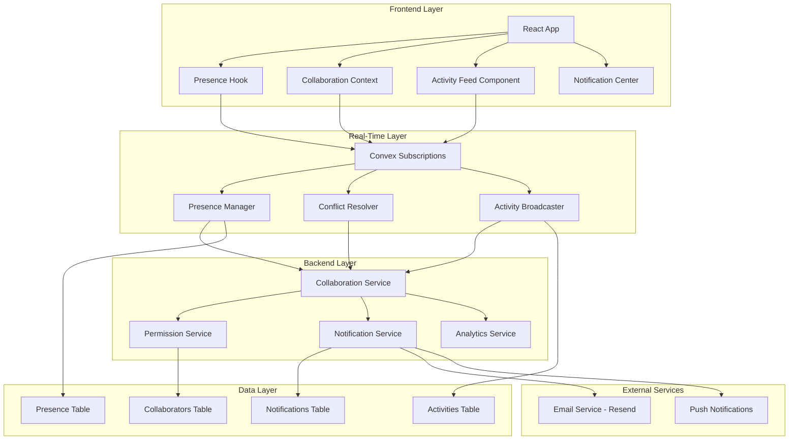
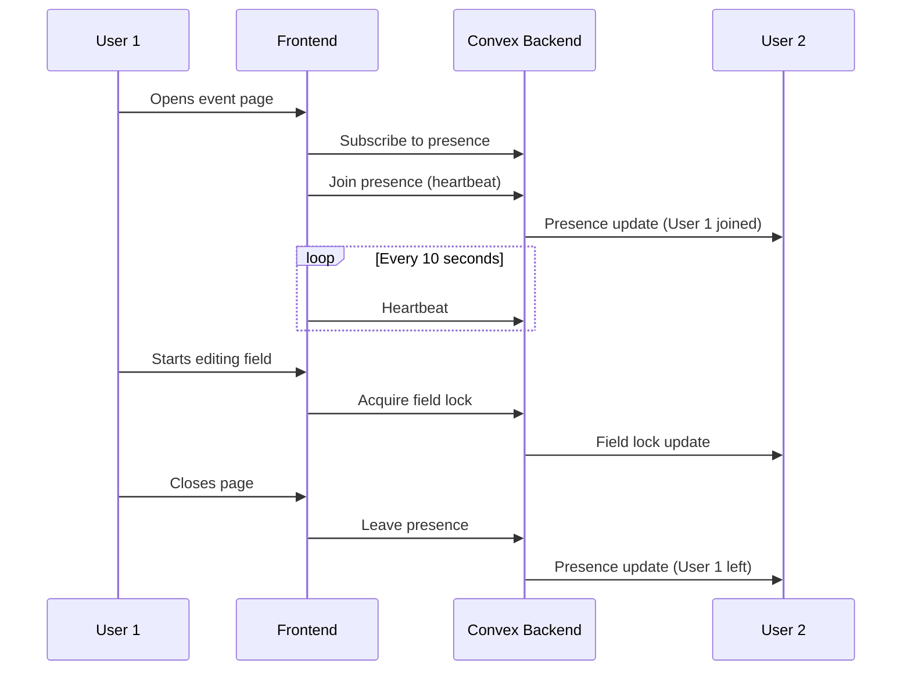

# Real-Time Collaboration Design Document

## Overview

This design document outlines the technical approach for adding real-time collaboration features to Open Event. The platform will be transformed from a single-user tool into a true team collaboration platform where multiple organizers can work together simultaneously on event planning.

The design leverages Convex's built-in real-time capabilities as the foundation, extending them with:

- **Presence System**: Real-time user presence and field-level editing indicators
- **Collaboration Engine**: Conflict resolution, optimistic updates, and offline support
- **Permission System**: Role-based access control for collaborators
- **Activity System**: Real-time activity feeds and collaboration analytics
- **Notification System**: Smart, configurable notifications across multiple channels

This approach minimizes new infrastructure while maximizing the real-time capabilities already available in the Convex stack.

## Architecture

### High-Level Architecture



### Presence Architecture

The presence system uses Convex's real-time subscriptions with heartbeat-based presence tracking:



### Conflict Resolution Strategy

The collaboration engine uses Operational Transformation (OT) principles with last-write-wins for simple fields:

1. **Non-conflicting edits**: Different fields edited simultaneously are merged automatically
2. **Conflicting edits**: Last write wins with notification to the overwritten user
3. **Complex objects**: Object-level locking with visual indicators (playground)

## Components and Interfaces

### 1. Presence Components

#### Presence Manager

```typescript
// convex/lib/collaboration/presence.ts
interface PresenceState {
  eventId: string
  userId: string
  userName: string
  userAvatar?: string
  lastSeen: number
  activeField?: string
  cursorPosition?: { x: number; y: number }
}

interface PresenceConfig {
  heartbeatInterval: number // 10 seconds
  staleThreshold: number // 30 seconds
  maxCollaborators: number // 50
}

class PresenceManager {
  join(eventId: string, userId: string): Promise<void>
  leave(eventId: string, userId: string): Promise<void>
  heartbeat(eventId: string, userId: string): Promise<void>
  setActiveField(eventId: string, userId: string, fieldId: string | null): Promise<void>
  setCursorPosition(
    eventId: string,
    userId: string,
    position: { x: number; y: number }
  ): Promise<void>
  getPresence(eventId: string): Promise<PresenceState[]>
  cleanupStale(): Promise<void>
}
```

#### Presence Hook (Frontend)

```typescript
// src/hooks/usePresence.ts
interface UsePresenceOptions {
  eventId: string
  onUserJoin?: (user: PresenceState) => void
  onUserLeave?: (userId: string) => void
}

interface UsePresenceReturn {
  users: PresenceState[]
  isConnected: boolean
  setActiveField: (fieldId: string | null) => void
  setCursorPosition: (position: { x: number; y: number }) => void
}

function usePresence(options: UsePresenceOptions): UsePresenceReturn
```

### 2. Collaboration Components

#### Collaboration Engine

```typescript
// convex/lib/collaboration/engine.ts
interface CollaborativeEdit {
  eventId: string
  userId: string
  fieldPath: string
  oldValue: unknown
  newValue: unknown
  timestamp: number
  clientId: string
}

interface ConflictResult {
  resolved: boolean
  winner: 'local' | 'remote'
  finalValue: unknown
  notifyUser?: string
}

class CollaborationEngine {
  applyEdit(edit: CollaborativeEdit): Promise<ConflictResult>
  queueOfflineEdit(edit: CollaborativeEdit): void
  syncOfflineEdits(): Promise<void>
  getFieldLock(eventId: string, fieldPath: string): Promise<string | null>
  acquireFieldLock(eventId: string, fieldPath: string, userId: string): Promise<boolean>
  releaseFieldLock(eventId: string, fieldPath: string, userId: string): Promise<void>
}
```

#### Optimistic Update Manager

```typescript
// src/lib/collaboration/optimisticUpdates.ts
interface OptimisticUpdate<T> {
  id: string
  fieldPath: string
  optimisticValue: T
  serverValue?: T
  status: 'pending' | 'confirmed' | 'rolled-back'
}

class OptimisticUpdateManager {
  apply<T>(fieldPath: string, value: T): string
  confirm(updateId: string): void
  rollback(updateId: string): void
  getPendingUpdates(): OptimisticUpdate<unknown>[]
}
```

### 3. Permission Components

#### Permission Service

```typescript
// convex/lib/collaboration/permissions.ts
type PermissionLevel = 'view' | 'edit' | 'admin'

interface Collaborator {
  id: string
  eventId: string
  userId: string
  email: string
  permissionLevel: PermissionLevel
  invitedBy: string
  invitedAt: number
  acceptedAt?: number
  status: 'pending' | 'active' | 'revoked'
}

interface InvitationToken {
  token: string
  eventId: string
  email: string
  permissionLevel: PermissionLevel
  expiresAt: number
}

class PermissionService {
  invite(
    eventId: string,
    email: string,
    level: PermissionLevel,
    invitedBy: string
  ): Promise<InvitationToken>
  acceptInvitation(token: string, userId: string): Promise<Collaborator>
  updatePermission(collaboratorId: string, newLevel: PermissionLevel): Promise<void>
  revokeAccess(collaboratorId: string): Promise<void>
  getCollaborators(eventId: string): Promise<Collaborator[]>
  checkPermission(eventId: string, userId: string, requiredLevel: PermissionLevel): Promise<boolean>
  terminateSession(userId: string, eventId: string): Promise<void>
}
```

### 4. Activity Components

#### Activity Service

```typescript
// convex/lib/collaboration/activity.ts
type ActivityType =
  | 'event_updated'
  | 'task_created'
  | 'task_completed'
  | 'budget_changed'
  | 'vendor_added'
  | 'sponsor_added'
  | 'collaborator_joined'
  | 'comment_added'

interface Activity {
  id: string
  eventId: string
  userId: string
  userName: string
  type: ActivityType
  description: string
  metadata: Record<string, unknown>
  timestamp: number
  groupId?: string // For grouping rapid changes
}

interface ActivityQuery {
  eventId: string
  limit?: number
  before?: number
  types?: ActivityType[]
}

class ActivityService {
  log(activity: Omit<Activity, 'id' | 'timestamp'>): Promise<Activity>
  getActivities(query: ActivityQuery): Promise<Activity[]>
  groupRecentActivities(eventId: string, userId: string, windowMs: number): Promise<void>
  pruneOldActivities(eventId: string, keepCount: number): Promise<void>
}
```

### 5. Notification Components

#### Notification Service

```typescript
// convex/lib/collaboration/notifications.ts
type NotificationChannel = 'in-app' | 'email' | 'push'
type NotificationPriority = 'low' | 'normal' | 'high' | 'critical'

interface NotificationPreferences {
  userId: string
  eventId: string
  channels: NotificationChannel[]
  mutedTypes: string[]
  batchNonUrgent: boolean
}

interface Notification {
  id: string
  userId: string
  eventId: string
  type: string
  title: string
  body: string
  priority: NotificationPriority
  channels: NotificationChannel[]
  metadata: Record<string, unknown>
  createdAt: number
  readAt?: number
  sentVia: NotificationChannel[]
}

class NotificationService {
  send(notification: Omit<Notification, 'id' | 'createdAt' | 'sentVia'>): Promise<void>
  getPreferences(userId: string, eventId: string): Promise<NotificationPreferences>
  updatePreferences(preferences: NotificationPreferences): Promise<void>
  markAsRead(notificationId: string): Promise<void>
  batchPendingNotifications(): Promise<void>
  sendCriticalNotification(
    eventId: string,
    notification: Omit<Notification, 'id' | 'createdAt' | 'sentVia' | 'userId'>
  ): Promise<void>
}
```

### 6. Analytics Components

#### Collaboration Analytics Service

```typescript
// convex/lib/collaboration/analytics.ts
interface ContributionMetrics {
  userId: string
  eventId: string
  editsCount: number
  tasksCompleted: number
  commentsAdded: number
  timeSpentMinutes: number
  lastActiveAt: number
}

interface CollaborationPeriod {
  startTime: number
  endTime: number
  activeUsers: number
  editsCount: number
}

interface CollaborationAnalytics {
  eventId: string
  totalCollaborators: number
  totalEdits: number
  totalTimeSpent: number
  peakPeriods: CollaborationPeriod[]
  contributionsByUser: ContributionMetrics[]
}

class CollaborationAnalyticsService {
  trackContribution(eventId: string, userId: string, type: string): Promise<void>
  trackTimeSpent(eventId: string, userId: string, minutes: number): Promise<void>
  getAnalytics(eventId: string, isAdmin: boolean): Promise<CollaborationAnalytics>
  identifyPeakPeriods(eventId: string): Promise<CollaborationPeriod[]>
}
```

## Data Models

### Collaborators Table

```typescript
// convex/schema.ts additions
collaborators: defineTable({
  eventId: v.id("events"),
  userId: v.optional(v.id("users")), // null for pending invitations
  email: v.string(),
  permissionLevel: v.union(v.literal("view"), v.literal("edit"), v.literal("admin")),
  invitedBy: v.id("users"),
  invitedAt: v.number(),
  acceptedAt: v.optional(v.number()),
  status: v.union(v.literal("pending"), v.literal("active"), v.literal("revoked")),
})
  .index("by_event", ["eventId"])
  .index("by_user", ["userId"])
  .index("by_email", ["email"])
  .index("by_event_user", ["eventId", "userId"]),

invitationTokens: defineTable({
  token: v.string(),
  collaboratorId: v.id("collaborators"),
  expiresAt: v.number(),
})
  .index("by_token", ["token"]),
```

### Presence Table

```typescript
presence: defineTable({
  eventId: v.id("events"),
  userId: v.id("users"),
  userName: v.string(),
  userAvatar: v.optional(v.string()),
  lastSeen: v.number(),
  activeField: v.optional(v.string()),
  cursorPosition: v.optional(v.object({
    x: v.number(),
    y: v.number(),
  })),
})
  .index("by_event", ["eventId"])
  .index("by_user", ["userId"])
  .index("by_event_user", ["eventId", "userId"]),
```

### Activities Table

```typescript
activities: defineTable({
  eventId: v.id("events"),
  userId: v.id("users"),
  userName: v.string(),
  type: v.string(),
  description: v.string(),
  metadata: v.any(),
  timestamp: v.number(),
  groupId: v.optional(v.string()),
})
  .index("by_event", ["eventId"])
  .index("by_event_timestamp", ["eventId", "timestamp"])
  .index("by_group", ["groupId"]),
```

### Notifications Table

```typescript
collaborationNotifications: defineTable({
  userId: v.id("users"),
  eventId: v.id("events"),
  type: v.string(),
  title: v.string(),
  body: v.string(),
  priority: v.union(v.literal("low"), v.literal("normal"), v.literal("high"), v.literal("critical")),
  metadata: v.any(),
  createdAt: v.number(),
  readAt: v.optional(v.number()),
  sentVia: v.array(v.string()),
  batchId: v.optional(v.string()),
})
  .index("by_user", ["userId"])
  .index("by_user_unread", ["userId", "readAt"])
  .index("by_batch", ["batchId"]),

notificationPreferences: defineTable({
  userId: v.id("users"),
  eventId: v.id("events"),
  channels: v.array(v.string()),
  mutedTypes: v.array(v.string()),
  batchNonUrgent: v.boolean(),
})
  .index("by_user_event", ["userId", "eventId"]),
```

### Analytics Tables

```typescript
collaborationMetrics: defineTable({
  eventId: v.id("events"),
  userId: v.id("users"),
  date: v.string(), // YYYY-MM-DD for daily aggregation
  editsCount: v.number(),
  tasksCompleted: v.number(),
  commentsAdded: v.number(),
  timeSpentMinutes: v.number(),
})
  .index("by_event", ["eventId"])
  .index("by_event_user", ["eventId", "userId"])
  .index("by_event_date", ["eventId", "date"]),
```

## Correctness Properties

_A property is a characteristic or behavior that should hold true across all valid executions of a system—essentially, a formal statement about what the system should do. Properties serve as the bridge between human-readable specifications and machine-verifiable correctness guarantees._

### Presence Properties

**Property 1: Presence Join Visibility**
_For any_ user joining an event page, their presence should be visible to all other users currently viewing that event within 1 second.
**Validates: Requirements 1.1**

**Property 2: Presence Leave Cleanup**
_For any_ user leaving an event page, their presence should be removed from all other users' views within 5 seconds.
**Validates: Requirements 1.2**

**Property 3: Field-Level Presence Indicator**
_For any_ user actively editing a field, all other users viewing that event should see an indicator showing who is editing that field.
**Validates: Requirements 1.3**

**Property 4: Concurrent Collaborator Capacity**
_For any_ event, the presence system should support up to 50 concurrent collaborators without degradation in update latency.
**Validates: Requirements 1.4**

### Collaboration Properties

**Property 5: Non-Conflicting Edit Preservation**
_For any_ set of edits to different fields made by different users simultaneously, all edits should be preserved in the final state without data loss.
**Validates: Requirements 2.1**

**Property 6: Conflict Resolution Consistency**
_For any_ two users editing the same field simultaneously, the system should resolve to a single consistent value using last-write-wins, and both users should be notified of the resolution.
**Validates: Requirements 2.2**

**Property 7: Real-Time Sync Latency**
_For any_ change made by a collaborator, the change should propagate to all other viewers within 500ms (or 200ms for playground).
**Validates: Requirements 2.3, 4.1, 6.1, 7.5, 8.4**

**Property 8: Optimistic Update Rollback**
_For any_ optimistic update that fails server-side validation, the UI should roll back to the previous state and display an error to the user.
**Validates: Requirements 2.4**

**Property 9: Offline Queue and Sync**
_For any_ changes made during network disconnection, the changes should be queued locally and synced to the server when connectivity is restored, preserving the order of operations.
**Validates: Requirements 2.5**

### Permission Properties

**Property 10: Invitation Token Security**
_For any_ invitation sent, the invitation token should be cryptographically secure, single-use, and expire within 7 days.
**Validates: Requirements 3.1**

**Property 11: Permission Level Enforcement**
_For any_ collaborator with a specific permission level, they should only be able to perform actions allowed by that level (view < edit < admin).
**Validates: Requirements 3.2**

**Property 12: Permission Change Immediacy**
_For any_ permission change, the new permission level should take effect immediately for all subsequent actions by that collaborator.
**Validates: Requirements 3.3**

**Property 13: Access Revocation Completeness**
_For any_ collaborator whose access is revoked, their active session should be terminated immediately and they should not be able to access the event.
**Validates: Requirements 3.4, 3.5**

### Activity Properties

**Property 14: Activity Content Completeness**
_For any_ activity logged, it should contain the user who made the change, what was changed, and when it occurred.
**Validates: Requirements 4.2**

**Property 15: Activity Grouping**
_For any_ sequence of rapid changes (within 30 seconds) by the same user, they should be grouped into a single activity entry.
**Validates: Requirements 4.3**

**Property 16: Activity Retention Limit**
_For any_ event, only the most recent 100 activities should be retained, with older activities being pruned.
**Validates: Requirements 4.5**

### Task Properties

**Property 17: Task Assignment Notification**
_For any_ task assigned to a collaborator, they should receive both an in-app notification and an email notification.
**Validates: Requirements 5.1**

**Property 18: Task Real-Time Updates**
_For any_ task status change, all collaborators viewing the event should see the update in real-time.
**Validates: Requirements 5.2**

**Property 19: Mention Notification Delivery**
_For any_ @mention in a task comment, the mentioned user should receive a notification regardless of their notification preferences.
**Validates: Requirements 5.3, 9.2**

**Property 20: Task Deadline Reminder**
_For any_ task with a deadline, a reminder notification should be sent to the assignee 24 hours before the deadline.
**Validates: Requirements 5.4**

### Budget Properties

**Property 21: Budget Approval Workflow**
_For any_ budget change exceeding the configured threshold, the change should require approval from an admin collaborator before being applied.
**Validates: Requirements 6.3**

**Property 22: Budget Audit Trail**
_For any_ budget modification, a complete audit trail entry should be created including the user, old value, new value, and timestamp.
**Validates: Requirements 6.4**

### Vendor/Sponsor Properties

**Property 23: Vendor Assignment Notification**
_For any_ vendor or sponsor status change, all collaborators assigned to that vendor/sponsor should be notified.
**Validates: Requirements 7.1**

**Property 24: Vendor Assignment Tracking**
_For any_ vendor or sponsor assigned to a collaborator, the assignment should be visible on the vendor/sponsor card.
**Validates: Requirements 7.2**

**Property 25: Collaborative Notes Visibility**
_For any_ note added to a vendor or sponsor, the note should be visible to all collaborators with at least view permission.
**Validates: Requirements 7.4**

### Playground Properties

**Property 26: Cursor Position Sharing**
_For any_ user in the playground, their cursor position should be visible to all other users in real-time.
**Validates: Requirements 8.1**

**Property 27: Concurrent Playground Editing**
_For any_ two users editing different objects in the playground simultaneously, both edits should be preserved without conflict.
**Validates: Requirements 8.2**

**Property 28: Object Locking**
_For any_ user selecting an object in the playground, that object should be locked for other users with a visual indicator showing who has it locked.
**Validates: Requirements 8.3**

**Property 29: Collaborative Undo/Redo**
_For any_ undo operation in the playground, it should only undo the current user's changes, not changes made by other users.
**Validates: Requirements 8.5**

### Notification Properties

**Property 30: Notification Preference Respect**
_For any_ notification sent, it should only be delivered via channels enabled in the user's preferences for that event.
**Validates: Requirements 9.1, 9.3**

**Property 31: Notification Batching**
_For any_ non-urgent notifications, they should be batched and delivered together rather than individually to prevent notification fatigue.
**Validates: Requirements 9.4**

**Property 32: Critical Notification Bypass**
_For any_ critical event (cancellation, major date change), notifications should be sent immediately to all collaborators, bypassing batching and preference filters.
**Validates: Requirements 9.5**

### Analytics Properties

**Property 33: Contribution Tracking Accuracy**
_For any_ action taken by a collaborator, it should be accurately attributed to them in the contribution metrics.
**Validates: Requirements 10.1, 10.2**

**Property 34: Activity Timeline Ordering**
_For any_ collaboration activity timeline, activities should be displayed in chronological order.
**Validates: Requirements 10.3**

**Property 35: Peak Period Identification**
_For any_ event with collaboration activity, the system should correctly identify periods with the highest activity.
**Validates: Requirements 10.4**

**Property 36: Privacy-Respecting Analytics**
_For any_ non-admin collaborator viewing analytics, they should only see aggregate metrics, not individual collaborator details.
**Validates: Requirements 10.5**

## Error Handling

### Connection Errors

```typescript
// Handle WebSocket disconnection
function handleDisconnection(eventId: string, userId: string) {
  // Mark user as potentially offline
  presenceManager.markPotentiallyOffline(userId, eventId)

  // Start reconnection attempts with exponential backoff
  reconnectWithBackoff(async () => {
    await presenceManager.rejoin(eventId, userId)
    await collaborationEngine.syncOfflineEdits()
  })
}

// Exponential backoff for reconnection
async function reconnectWithBackoff(fn: () => Promise<void>, maxRetries = 5) {
  for (let attempt = 0; attempt < maxRetries; attempt++) {
    try {
      await fn()
      return
    } catch (error) {
      const delay = Math.min(1000 * Math.pow(2, attempt), 30000)
      await sleep(delay)
    }
  }
  // Show offline mode UI
  showOfflineMode()
}
```

### Conflict Errors

```typescript
// Handle edit conflicts
function handleConflict(conflict: ConflictResult, edit: CollaborativeEdit) {
  if (conflict.winner === 'remote') {
    // Roll back optimistic update
    optimisticUpdateManager.rollback(edit.clientId)

    // Notify user
    toast.warning('Your change was overwritten by another user', {
      description: `${conflict.notifyUser} made a conflicting edit`,
      action: {
        label: 'View Changes',
        onClick: () => showDiff(edit.oldValue, conflict.finalValue),
      },
    })
  }
}
```

### Permission Errors

```typescript
// Handle permission denied
function handlePermissionDenied(action: string, requiredLevel: PermissionLevel) {
  toast.error('Permission Denied', {
    description: `You need ${requiredLevel} permission to ${action}`,
    action: {
      label: 'Request Access',
      onClick: () => requestAccessUpgrade(requiredLevel),
    },
  })
}

// Handle session termination
function handleSessionTerminated(eventId: string) {
  // Clear local state
  clearEventState(eventId)

  // Redirect to events list
  navigate('/dashboard/events')

  // Show notification
  toast.info('Your access to this event has been revoked')
}
```

## Testing Strategy

### Property-Based Testing Configuration

We'll use **fast-check** for TypeScript property-based testing:

```bash
npm install --save-dev fast-check
```

Each property test will:

- Run minimum 100 iterations
- Include a comment tag referencing the design property
- Generate realistic test data using custom arbitraries

### Test Organization

```
convex/lib/collaboration/
├── presence.ts
├── presence.test.ts
├── presence.property.test.ts
├── engine.ts
├── engine.test.ts
├── engine.property.test.ts
├── permissions.ts
├── permissions.test.ts
├── permissions.property.test.ts
├── activity.ts
├── activity.test.ts
├── activity.property.test.ts
├── notifications.ts
├── notifications.test.ts
├── notifications.property.test.ts
├── analytics.ts
├── analytics.test.ts
└── analytics.property.test.ts

src/hooks/
├── usePresence.ts
├── usePresence.test.ts
├── useCollaboration.ts
├── useCollaboration.test.ts
└── useCollaboration.property.test.ts
```

### Example Property Test

```typescript
import fc from 'fast-check'

/**
 * Feature: real-time-collaboration, Property 5: Non-Conflicting Edit Preservation
 * Validates: Requirements 2.1
 */
test('preserves all non-conflicting edits from multiple users', () => {
  fc.assert(
    fc.property(
      // Generate multiple edits to different fields
      fc.array(
        fc.record({
          userId: fc.uuid(),
          fieldPath: fc.constantFrom('title', 'description', 'location', 'date'),
          value: fc.string(),
          timestamp: fc.nat(),
        }),
        { minLength: 2, maxLength: 10 }
      ),
      (edits) => {
        // Filter to non-conflicting edits (different fields)
        const uniqueFields = new Set(edits.map((e) => e.fieldPath))
        const nonConflicting = edits.filter(
          (e, i) => edits.findIndex((x) => x.fieldPath === e.fieldPath) === i
        )

        // Apply all edits
        const result = collaborationEngine.applyEdits(nonConflicting)

        // Verify all edits are preserved
        for (const edit of nonConflicting) {
          expect(result[edit.fieldPath]).toBe(edit.value)
        }
      }
    ),
    { numRuns: 100 }
  )
})
```

### Integration Testing

Key integration points to test:

1. **Presence + Convex Subscriptions**: Verify real-time presence updates
2. **Collaboration + Optimistic Updates**: Verify rollback on conflict
3. **Permissions + All Operations**: Verify permission enforcement
4. **Notifications + Email Service**: Verify email delivery
5. **Analytics + Activity Logging**: Verify accurate tracking

### Load Testing

Scenarios to test:

1. **50 Concurrent Users**: Verify presence system handles max capacity
2. **Rapid Edits**: Verify conflict resolution under high edit frequency
3. **Large Activity Feeds**: Verify performance with 100+ activities
4. **Notification Batching**: Verify batching under high notification volume

## Implementation Notes

### Phased Rollout

**Phase 1: Core Presence (Week 1)**

- Presence table and manager
- usePresence hook
- Presence indicators UI

**Phase 2: Collaboration Engine (Week 2)**

- Conflict resolution
- Optimistic updates
- Offline support

**Phase 3: Permissions (Week 3)**

- Collaborator management
- Invitation system
- Permission enforcement

**Phase 4: Activity & Notifications (Week 4)**

- Activity feed
- Notification service
- Email integration

**Phase 5: Analytics & Polish (Week 5)**

- Collaboration analytics
- Playground integration
- Performance optimization

### Performance Considerations

1. **Presence Heartbeats**: Use 10-second intervals to balance freshness vs. load
2. **Activity Pruning**: Run cleanup job hourly to maintain 100-activity limit
3. **Notification Batching**: Batch non-urgent notifications every 5 minutes
4. **Cursor Throttling**: Throttle cursor position updates to 10 per second

### Security Considerations

1. **Invitation Tokens**: Use cryptographically secure random tokens
2. **Permission Checks**: Validate permissions on every mutation
3. **Session Termination**: Immediately invalidate sessions on access revocation
4. **Rate Limiting**: Apply rate limits to presence updates and notifications
